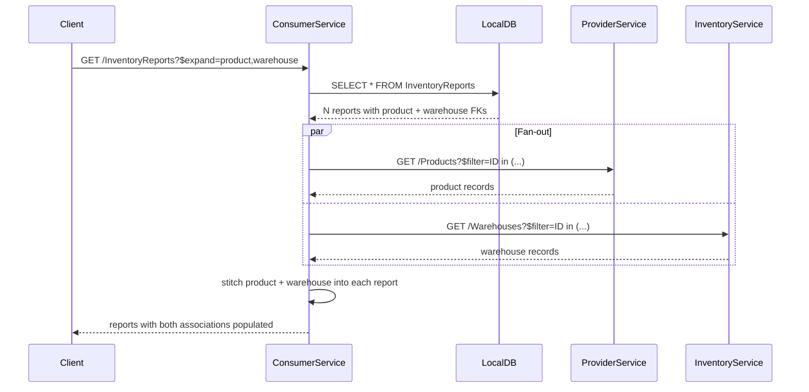

# Cross-Provider Mashup

Federation is not limited to one remote system. A single local entity can reference federated entities in **different** remote services, and a single `$expand` request fans out to both providers in parallel.

## When to use this pattern

- Your app composes a workflow that spans multiple systems — e.g., product master data in one ERP, inventory in a warehouse system, pricing in a CPQ.
- You want one API surface (one OData service, one URL) that mashes them up for the client.
- Each provider stays independent; the consumer is the integration point.

## The CDS model

Two remote services, declared in `package.json` under `cds.requires`, with their metadata imported as separate CSN files:

```json title="package.json"
{
  "cds": {
    "requires": {
      "ProviderService": {
        "kind": "odata",
        "model": "srv/external/ProviderService",
        "credentials": { "url": "http://localhost:4444/odata/v4/provider" }
      },
      "InventoryService": {
        "kind": "odata",
        "model": "srv/external/InventoryService",
        "credentials": { "url": "http://localhost:4445/odata/v4/inventory" }
      }
    }
  }
}
```

One local entity with associations to federated projections on **both** services:

```cds title="db/schema.cds"
using { ProviderService as remote } from '../srv/external/ProviderService';
using { InventoryService as inv } from '../srv/external/InventoryService';

// Local entity joining two remote providers
entity InventoryReports {
    key ID        : UUID;
        product   : Association to Products;     // → ProviderService (:4444)
        warehouse : Association to Warehouses;   // → InventoryService (:4445)
        note      : String(500);
        createdAt : Timestamp;
}

// Federated from provider A
@federation.delegate
entity Products as projection on remote.Products {
    ID    as productId,
    name  as productName,
    category,
    price as unitPrice,
    currency
};

// Federated from provider B
@federation.delegate
entity Warehouses as projection on inv.Warehouses;
```

`InventoryReports` gets two FK columns materialized locally: `product_productId` (→ ProviderService) and `warehouse_ID` (→ InventoryService). Neither remote service knows about the other; the consumer stitches them together.

## The request

=== "HTTP"

    ```http
    GET /consumer/InventoryReports?$expand=product,warehouse
    ```

=== "CQL"

    ```javascript
    SELECT.from(InventoryReports).columns(
        '*',
        r => r.product('*'),
        r => r.warehouse('*')
    );
    ```

## Under the hood

The plugin resolves each federated expand item against the service that owns it, independently:



Each expand is a separate Scenario B batch-fetch, targeted at the correct remote service. The plugin identifies the owning service from each association's target projection (via the `projection on <service>.<entity>` clause) at plugin load time.

## Running the demo

The repository's `examples/consumer` app has a runnable tile for this pattern:

- Start the providers: `npm run examples:start` from the repo root.
- Open [http://localhost:4004/launchpage.html](http://localhost:4004/launchpage.html).
- Click the **Inventory Reports** tile to see the list-report UI populated from both providers.

## Gotchas

- **Failure modes are not transactional.** If Provider A responds and Provider B times out, you get partial data — the plugin will return the primary local rows and whichever expand completed. Use `cds.log('cds-data-federation')` output and HTTP status propagation from the adapter to detect partials.
- **No cross-provider `$filter` path traversal.** You can filter by `product/productName` (same service as the FK) but not by a combined predicate spanning two providers — each cross-service filter resolves to one remote call, not a coordinated query.
- **Latency adds up.** Two remote calls run in parallel, but the response is only as fast as the slowest provider. Consider caching (`cache: { ttl: ... }` on either delegate) for read-heavy reference data — see [First Cache](first-cache.md).
- **Key collisions.** If both providers happen to use the same ID space (e.g. `'P001'`), nothing breaks — the FK columns are distinct (`product_productId` vs `warehouse_ID`). Still, prefer distinct key shapes to avoid confusing responses.

## See also

- [Joining Local with Remote](joining-local-with-remote.md) — the single-provider version of this pattern.
- [First Cache](first-cache.md) — reduce round-trips for read-heavy cross-provider calls.
- [$expand Scenarios](../concepts/expand-scenarios.md) — especially the "B1-B14" cross-provider cases.
