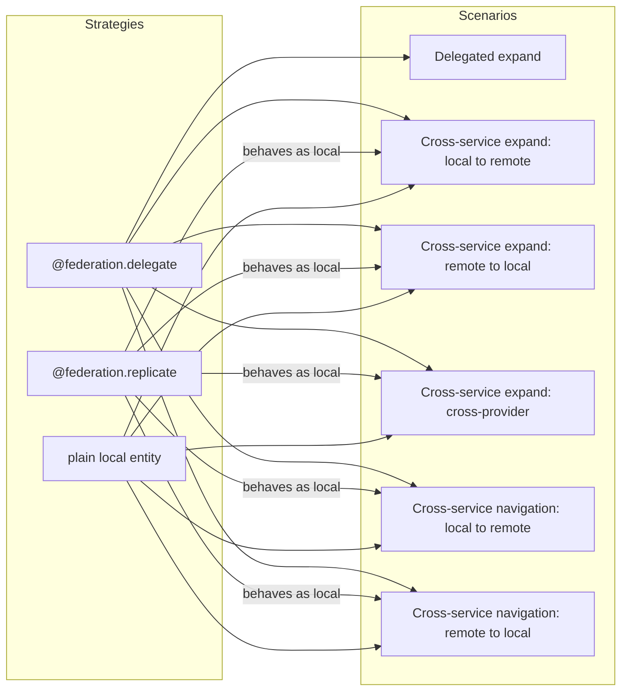

# Cross-Service Scenarios: `$expand` and Navigation

This is the canonical reference for every **cross-service scenario** the plugin handles: the four `$expand` topologies and the two navigation flows. For each scenario, we separate **what the CAP runtime provides out of the box** from **what this plugin adds on top** — the exact contract the plugin promises.

The naming is directional and CAP-aligned. The short labels in code and tests (`A`, `B`, `C`, `N1`, `N2`) are kept for now; see [Legend](#legend-previous-scenario-labels) at the bottom to map them to the new names.

---

## How CAP processes `$expand`

CAP does **not** split `$expand` into separate queries. The OData adapter parses `$expand=buyer` into a CQN column object with an `.expand` property, embedded in `req.query.SELECT.columns`:

```javascript
req.query = {
    SELECT: {
        from: { ref: ['Orders'] },
        columns: [
            '*',
            { ref: ['buyer'], expand: ['*'] }   // ← expand item
        ]
    }
}
```

The handler receives the full query including expand items. CAP expects the handler to return results with the expanded data already nested:

```javascript
[{
    orderId: 'O001',
    buyer: { ID: 'C001', name: 'Acme Corp', ... }
}]
```

If the handler returns flat results (no `buyer` object), the expand is silently empty. This is the mechanism every scenario below rides on top of.

Ref: [Service Integration guide: Navigation & Expands Across Services](https://cap.cloud.sap/docs/guides/integration/calesi)

---

## Topology at a glance

| Scenario | Main entity | Expanded entity | Same provider? |
|---|---|---|---|
| [Delegated expand](#delegated-expand) | remote | remote | yes |
| [Cross-service expand: local → remote](#cross-service-expand-local-remote) | local | remote | n/a |
| [Cross-service expand: remote → local](#cross-service-expand-remote-local) | remote | local | n/a |
| [Cross-service expand: cross-provider](#cross-service-expand-cross-provider) | local | remote | **no** — different providers per expand item |
| [Cross-service navigation: local → remote](#cross-service-navigation-local-remote) | local (entry) | remote (tail) | n/a |
| [Cross-service navigation: remote → local](#cross-service-navigation-remote-local) | remote (entry) | local (tail) | n/a |

---

## Strategies and scenarios

Every cross-service scenario has the **remote side pinned to `@federation.delegate`** — there are no exceptions. The **local side** can be either a plain local CDS entity (stored in `cds.db`) or a `@federation.replicate` view. From a query-time perspective these are indistinguishable, because replicate materializes its data into an ordinary local table. As a consequence, **`@federation.replicate` has no scenarios of its own**; it only participates as the local side of a cross-service flow.

| Scenario | Main entity | Expand / navigation target |
|---|---|---|
| [Delegated expand](#delegated-expand) | `@federation.delegate` | `@federation.delegate` (same provider) |
| [Cross-service expand: local → remote](#cross-service-expand-local-remote) | local *or* `@federation.replicate` | `@federation.delegate` |
| [Cross-service expand: remote → local](#cross-service-expand-remote-local) | `@federation.delegate` | local *or* `@federation.replicate` |
| [Cross-service expand: cross-provider](#cross-service-expand-cross-provider) | local *or* `@federation.replicate` | `@federation.delegate` (multiple providers) |
| [Cross-service navigation: local → remote](#cross-service-navigation-local-remote) | local *or* `@federation.replicate` | `@federation.delegate` |
| [Cross-service navigation: remote → local](#cross-service-navigation-remote-local) | `@federation.delegate` | local *or* `@federation.replicate` |



---

Each section below follows the same four-part template:

1. **What it is** — one-paragraph definition, one concrete `GET` example, one-line topology summary.
2. **What CAP provides out of the box** — what the CAP runtime does (or fails to do) *without this plugin*.
3. **What this plugin adds** — the specific handler, function, or registry entry, with a pointer to the source file.
4. **Status and test coverage** — `supported` / `partial` / `planned`, with the test ids still used in the [`packages/cds-data-federation/test/integration/`](https://github.com/mikezaschka/cds-data/tree/main/packages/cds-data-federation/test/integration) suite.

---

## Delegated expand

### What it is

A `$expand` whose main entity and the expand target both live on the **same remote provider**. The consumer's local entities are pure consumption views over that provider.

```
GET /consumer/Orders?$expand=buyer
```

- `Orders` is `@federation.delegate` on `ProviderService.Orders`.
- `buyer` association (renamed from `customer`) points to `ProviderService.Customers`.
- Both resolve to the same remote service.

**Topology:** remote → remote (same provider).

**Applies to strategies:** `@federation.delegate` on both sides (same provider).

### What CAP provides out of the box

**Everything.** CAP's runtime handles this scenario completely via `remote.run(req.query)` and its [Automatic Query Translation](https://cap.cloud.sap/docs/guides/integration/calesi#delegation) along the projection chain:

- Column rename translation in `$select`, `$filter`, `$orderby` (via `as` clauses in the projection).
- Column restriction to projected fields only.
- Association rename translation in `$expand` (`buyer` → `customer`).
- Forwarding of `$expand` to the remote service.
- Nested expands, `$select` within expands, to-many associations.
- Mapping expanded results back through the target entity's projection.

Demonstrated in SAP's [xtravels sample](https://github.com/capire/xtravels) with a one-line handler:

```js
this.on('READ', Customers, req => s4.run(req.query))
```

### What this plugin adds

**Nothing in the read path.** The plugin's `@federation.delegate` handler is conceptually the same one-liner; CAP does the work.

The only value-add is **optional response-level caching** when the entity is annotated with a TTL:

```cds
@federation.delegate: { cache: { ttl: 60000 } }
entity Orders as projection on ProviderService.Orders { ... }
```

The cache wraps the outbound `remote.run(req.query)` call — including the entire `$expand` payload — via the peer dependency [`cds-caching`](https://github.com/mikezaschka/cds-caching) (`cache.strategy: 'response'`, default). **`cache.strategy: 'entity'`** caches direct delegated-entity READs in SQLite; cross-service expand batch fetches still use the delegate path in the current release. See [Caching](../integration/caching.md).

### Status and test coverage

**Supported.** Covered by tests `A1–A7` in [`packages/cds-data-federation/test/integration/delegate/basic.test.js`](https://github.com/mikezaschka/cds-data/blob/main/packages/cds-data-federation/test/integration/delegate/basic.test.js) (to-one renames, to-many, multi-expand, nested expand, `$expand` + `$select`, single-entity key access).

---

## Cross-service expand: local → remote

### What it is

The main entity is **local** (stored in the consumer's DB or another local service) and has an association to a **remote** entity. OData requests expanding that association cross a service boundary that neither service can resolve alone.

```
GET /consumer/Reviews?$expand=product
```

- `Reviews` is a local entity (persisted via `cds.db`).
- `product` points to `Products`, which is `@federation.delegate` on the remote `ProviderService.Products`.

**Topology:** local → remote.

**Applies to strategies:** local entity *or* `@federation.replicate` as main; `@federation.delegate` on the expand target.

### What CAP provides out of the box

The local DB service resolves the main `Reviews` query, including `$filter`, `$orderby`, and `$select` on local columns. But CAP's DB service **cannot resolve `$expand` targets across service boundaries** — its expand handling is implemented as correlated SQL subqueries, which don't make sense for a remote OData/REST service. The expanded field comes back silently empty.

No native CAP mechanism collects foreign keys from one service's result and issues a follow-up query against another service.

### What this plugin adds

`registerLocalExpandResolvers()` registers an `after('READ')` handler on the local entity that implements the **batch-fetch + stitch** pattern:

1. Let the local DB read `Reviews` without the remote expand.
2. Inspect the original query for expand items whose target is `@federation.delegate`.
3. Collect distinct foreign key values (`product_ID`) from the results.
4. Issue a single remote call: `GET Products?$filter=ID in ('P001','P002',...)`.
5. Apply **rename mapping via the view mapping registry** (e.g., `productId`/`productName` ↔ `ID`/`name`).
6. Stitch the fetched records back into the main result as nested objects.
7. Optionally cache the remote sub-query (the outbound batch-fetch is a cacheable unit).

Source: [`srv/delegation/expand-local-to-remote.js`](https://github.com/mikezaschka/cds-data/blob/main/packages/cds-data-federation/srv/delegation/expand-local-to-remote.js). Registry is populated by [`srv/annotation-scanner.js`](https://github.com/mikezaschka/cds-data/blob/main/packages/cds-data-federation/srv/annotation-scanner.js) and consumed by `resolveFederatedExpand()`.

### Status and test coverage

**Supported.** Covered by tests `B1–B3` in [`packages/cds-data-federation/test/integration/expand-local-to-remote/cross-service-expand-local-to-remote.test.js`](https://github.com/mikezaschka/cds-data/blob/main/packages/cds-data-federation/test/integration/expand-local-to-remote/cross-service-expand-local-to-remote.test.js) (basic local → delegate, multiple local → delegate associations, `$select` within the remote sub-query).

---

## Cross-service expand: remote → local

### What it is

The main entity is **remote** (fetched via a `@federation.delegate` consumption view) and has an association back into a **local** entity — typically a local extension or annotation table owned by the consumer.

```
GET /consumer/Customers('C001')?$expand=bookmarks
```

- `Customers` is `@federation.delegate` on `ProviderService.Customers`.
- `bookmarks` is a local association (unmanaged, keyed by `customer_ID`) to a local `Bookmarks` table the consumer owns.

**Topology:** remote → local.

**Applies to strategies:** `@federation.delegate` as main; local entity *or* `@federation.replicate` on the expand target.

### What CAP provides out of the box

The remote main fetch works: CAP runs `Customers('C001')` against `ProviderService` via the delegate handler. But CAP **cannot expand into a local association from a remote result** — the remote provider has no knowledge of the consumer's local `bookmarks` association, and CAP does not automatically issue a follow-up query against the local DB to resolve it.

### What this plugin adds

Three functions in [`srv/delegation/expand-remote-to-local.js`](https://github.com/mikezaschka/cds-data/blob/main/packages/cds-data-federation/srv/delegation/expand-remote-to-local.js) cooperate:

1. `buildLocalAssocInfo()` — inspects the consumption view's CSN for local (non-federated) association targets.
2. `splitLocalExpands()` — before forwarding to the remote, strips local-target expand items out of the query so the remote doesn't reject them.
3. `resolveRemoteToLocalExpands()` — after the remote response lands, queries the local DB by the foreign key(s) on the remote result rows, then stitches the local records into the response.

The result: from the consumer's perspective, `$expand=bookmarks` "just works" on a remote entity.

### Status and test coverage

**Supported.** Covered by the `C`-prefixed tests in [`packages/cds-data-federation/test/integration/expand-remote-to-local/cross-service-expand-remote-to-local.test.js`](https://github.com/mikezaschka/cds-data/blob/main/packages/cds-data-federation/test/integration/expand-remote-to-local/cross-service-expand-remote-to-local.test.js) (remote customer with local bookmarks, key and filtered access).

---

## Cross-service expand: cross-provider

### What it is

A variant of **local → remote** where a single local entity expands associations that resolve to **different remote providers**. A single delegated query can never cover both, because CAP's outbound service is fixed per entity.

```
GET /consumer/Orders?$expand=buyer,shipment
```

- `Orders` is local (or a local view).
- `buyer` → `CustomerService.Customers` (provider #1).
- `shipment` → `LogisticsService.Shipments` (provider #2).

**Topology:** local → remote, with expand targets split across multiple providers.

**Applies to strategies:** local entity *or* `@federation.replicate` as main; `@federation.delegate` on multiple different providers.

### What CAP provides out of the box

**Nothing specific to this case.** Two different remotes can never share a single delegated query. CAP doesn't fail loudly either — each cross-service expand item silently comes back empty for the same reason as plain local → remote.

### What this plugin adds

The same batch-fetch + stitch machinery as local → remote, applied per provider: the resolver splits expanded items by their source service and issues **one remote call per provider**, stitching each result set independently. No extra annotation or configuration is needed — the plugin reads each expanded entity's `@federation.delegate` annotation to discover its provider.

In practice, this is already **implicitly supported** today via the local → remote code path; see the walkthrough in [Cross-Provider Mashup](/federation/getting-started/cross-provider-mashup). This doc now calls it out as its own case so the contract is explicit.

### Status and test coverage

**Supported, not separately tested.** No dedicated `CP`-prefixed tests exist yet; the scenario currently rides on top of the `B`-series machinery. **Gap to address in the follow-up rename/test pass** — we should add a dedicated test case for `$expand` across two providers so regressions surface clearly.

---

## Cross-service navigation: local → remote

### What it is

An OData path expression that traverses an association from a **local** entry entity into a **remote** target entity.

```
GET /consumer/Customers('C001')/orders
```

- `Customers` is local (possibly a projection), `orders` points to `Orders` which is `@federation.delegate`.
- Equivalent CQN: `SELECT from Orders where customer_ID = 'C001'`.

Distinct from `$expand`: the path expression *is the query*, not a sub-request nested inside a larger result.

**Applies to strategies:** local entity *or* `@federation.replicate` as entry; `@federation.delegate` on the target.

### What CAP provides out of the box

CAP resolves navigation paths within a single service only. When the navigation target lives behind a different service, CAP does not automatically rewrite the path into a filter on the target service.

### What this plugin adds

`resolveLocalToRemoteNavigation()` in [`srv/delegation/cross-service-navigation.js`](https://github.com/mikezaschka/cds-data/blob/main/packages/cds-data-federation/srv/delegation/cross-service-navigation.js) rewrites the navigation path at the entry point:

1. Detect the navigation segment whose target is remote-backed.
2. Resolve the key(s) of the local entry (`Customers('C001')`) against the local DB if the entry is persistent, or against the upstream provider if the entry is itself a remote view.
3. Translate the association into a `$filter` on the remote target using the registered key mapping (e.g., `customer_ID eq 'C001'`).
4. Delegate the resulting query as a standard `@federation.delegate` READ.

### Status and test coverage

**Supported.** Covered by tests labelled `N1` (and related cases `N3`, `N4`) in [`packages/cds-data-federation/test/integration/navigation/cross-service-navigation.test.js`](https://github.com/mikezaschka/cds-data/blob/main/packages/cds-data-federation/test/integration/navigation/cross-service-navigation.test.js). Sequence diagrams and gotchas in [Joining Local with Remote](/federation/getting-started/joining-local-with-remote).

---

## Cross-service navigation: remote → local

### What it is

The inverse of the previous scenario: the entry entity is **remote**, and the navigation tail points at a **local** association.

```
GET /consumer/Orders('O001')/bookmarks
```

- `Orders` is `@federation.delegate` on `ProviderService.Orders`.
- `bookmarks` is a local unmanaged association on the consumer side, keyed by `order_ID`.

**Applies to strategies:** `@federation.delegate` as entry; local entity *or* `@federation.replicate` on the target.

### What CAP provides out of the box

The same limitation as local → remote: CAP handles navigation only within one service. A path that starts on a remote entity and ends on a local association is not rewritten automatically.

### What this plugin adds

`rewriteRemoteToLocalNavigation()` in the same [`srv/delegation/cross-service-navigation.js`](https://github.com/mikezaschka/cds-data/blob/main/packages/cds-data-federation/srv/delegation/cross-service-navigation.js) handles the mirror-image rewrite:

1. Fetch the remote entry (`Orders('O001')`) via the standard delegate path.
2. Extract the foreign key values needed to resolve the local association.
3. Issue a local query: `SELECT from Bookmarks where order_ID = 'O001'`.
4. Return the local result set as the response body.

### Status and test coverage

**Supported.** Covered by tests labelled `N2` (and related case `N5`) in [`packages/cds-data-federation/test/integration/navigation/cross-service-navigation.test.js`](https://github.com/mikezaschka/cds-data/blob/main/packages/cds-data-federation/test/integration/navigation/cross-service-navigation.test.js). Walkthrough in [Extending Remote with Local](/federation/getting-started/extending-remote-with-local).

---

## View Mapping Registry

The registry is populated by [`srv/annotation-scanner.js`](https://github.com/mikezaschka/cds-data/blob/main/packages/cds-data-federation/srv/annotation-scanner.js) during CAP bootstrap and consumed by the batch-fetch resolvers. It exists **only to support cross-service expand: local → remote (and cross-provider)** — the one scenario where CAP's automatic query translation can't help because the translation straddles two services.

```javascript
// Built during annotation scanning, stored globally
const viewMappingRegistry = {
    'consumer.Customers': { isWildcard: true, localToRemote: {}, remoteToLocal: {} },
    'consumer.Products':  {
        isWildcard: false,
        projectedColumns: ['ID', 'name', 'category', 'price', 'currency'],
        localToRemote: { productId: 'ID', productName: 'name', unitPrice: 'price' },
        remoteToLocal: { ID: 'productId', name: 'productName', price: 'unitPrice' }
    },
    'consumer.Orders': {
        isWildcard: false,
        projectedColumns: ['ID', 'customer', 'product', 'quantity', 'total', 'status', 'orderDate', 'modifiedAt'],
        localToRemote: { orderId: 'ID', buyer: 'customer', item: 'product', amount: 'total', placedOn: 'orderDate' },
        remoteToLocal: { ID: 'orderId', customer: 'buyer', product: 'item', total: 'amount', orderDate: 'placedOn' }
    }
}
```

For the other scenarios the registry is not read: delegated expand and delegated navigation ride on CAP's native projection-chain translation; remote → local expand/navigation don't need outbound field renames because the second hop goes to the local DB which already speaks local names.

**Known limitation:** When multiple consumer entities project the same remote source (e.g., both `Customers` and `Suppliers` project `ProviderService.Customers`), the registry also stores entries keyed by source name — and the last registration wins. Entity-full-name keys remain distinct and are preferred for lookups.

---

## Test matrix

The `A`, `B`, `C`, `N1`, `N2` ids below are the short test identifiers used in the [`packages/cds-data-federation/test/integration/`](https://github.com/mikezaschka/cds-data/tree/main/packages/cds-data-federation/test/integration) suite and the `.http` files under [`examples/`](https://github.com/mikezaschka/cds-data/tree/main/examples). Prose uses the canonical directional names from the [Legend](#legend-previous-scenario-labels).

### Delegated expand (A)

All entities are `@federation.delegate` on the same remote provider.

| # | Test | Request | Status | Validates |
|---|---|---|---|---|
| A1 | Orders → buyer (to-one, renamed assoc) | `Orders?$expand=buyer` | **passing** | CAP translates buyer → customer, maps result back |
| A2 | Orders → item (to-one, renamed assoc + renamed fields) | `Orders?$expand=item` | **passing** | CAP translates item → product, maps inner fields |
| A3 | Customers → orders (to-many) | `Customers('C001')?$expand=orders` | **passing** | Array of orders nested under customer |
| A4 | Orders → buyer,item (multiple expands) | `Orders?$expand=buyer,item` | **passing** | Both associations expanded in a single request |
| A5 | Nested expand | `Orders('O001')?$expand=buyer($expand=orders)` | **passing** | Recursive: order.buyer.orders |
| A6 | $expand with $select | `Orders?$expand=buyer($select=ID,name)` | **passing** | Only selected fields in expanded data |
| A7 | Single entity with expand | `Orders('O001')?$expand=buyer` | **passing** | Single order with expanded buyer |

### Cross-service expand: local → remote (B)

Main entity is local, expanded entity is remote / `@federation.delegate`.

| # | Test | Request | Status | Validates |
|---|---|---|---|---|
| B1 | Reviews → product (local → delegate) | `Reviews?$expand=product` | **passing** | Remote product data stitched into local reviews |
| B2 | Bookmarks → customer (local → delegate) | `Bookmarks?$expand=customer` | **passing** | Remote customer data fetched and stitched |
| B3 | Reviews → product with $select | `Reviews?$expand=product($select=productId,productName)` | **passing** | Only selected fields fetched from remote |

### Cross-service expand: remote → local (C)

Main entity is remote / `@federation.delegate`, expanded entity is local.

See the `C`-prefixed tests in [`packages/cds-data-federation/test/integration/expand-remote-to-local/cross-service-expand-remote-to-local.test.js`](https://github.com/mikezaschka/cds-data/blob/main/packages/cds-data-federation/test/integration/expand-remote-to-local/cross-service-expand-remote-to-local.test.js).

### Cross-service navigation (N1 / N2)

| # | Direction | Example path | Status |
|---|---|---|---|
| N1 | local → remote | `Customers('C001')/orders` | **passing** |
| N2 | remote → local | `Orders('O001')/bookmarks` | **passing** |
| N3–N5 | related cases | see test file | **passing** |

---

## Implementation status

| Scenario | Strategies | Status | Source |
|---|---|---|---|
| Delegated expand | `@federation.delegate` ↔ `@federation.delegate` (same provider) | **Done** — CAP handles natively via `remote.run(req.query)` | (no plugin code) |
| Cross-service expand: local → remote | local / `@federation.replicate` ↔ `@federation.delegate` | **Done** | [`srv/delegation/expand-local-to-remote.js`](https://github.com/mikezaschka/cds-data/blob/main/packages/cds-data-federation/srv/delegation/expand-local-to-remote.js) |
| Cross-service expand: remote → local | `@federation.delegate` ↔ local / `@federation.replicate` | **Done** | [`srv/delegation/expand-remote-to-local.js`](https://github.com/mikezaschka/cds-data/blob/main/packages/cds-data-federation/srv/delegation/expand-remote-to-local.js) |
| Cross-service expand: cross-provider | local / `@federation.replicate` ↔ `@federation.delegate` (multiple providers) | **Supported, not separately tested** | (rides on local → remote) |
| Cross-service navigation: local → remote | local / `@federation.replicate` ↔ `@federation.delegate` | **Done** | [`srv/delegation/cross-service-navigation.js`](https://github.com/mikezaschka/cds-data/blob/main/packages/cds-data-federation/srv/delegation/cross-service-navigation.js) |
| Cross-service navigation: remote → local | `@federation.delegate` ↔ local / `@federation.replicate` | **Done** | [`srv/delegation/cross-service-navigation.js`](https://github.com/mikezaschka/cds-data/blob/main/packages/cds-data-federation/srv/delegation/cross-service-navigation.js) |
| View mapping registry | — (infrastructure, used only by cross-service expand: local → remote and cross-provider) | **Done** | [`srv/annotation-scanner.js`](https://github.com/mikezaschka/cds-data/blob/main/packages/cds-data-federation/srv/annotation-scanner.js) |
| Response-level caching for delegated expand | `@federation.delegate` | **Done** — via [`cds-caching`](https://github.com/mikezaschka/cds-caching) | (peer dependency) |

---

## See also

Task-focused walkthroughs that demonstrate these scenarios in practice:

- [Joining Local with Remote](/federation/getting-started/joining-local-with-remote) — cross-service expand: local → remote and cross-service navigation: local → remote, with sequence diagrams.
- [Extending Remote with Local](/federation/getting-started/extending-remote-with-local) — cross-service expand: remote → local and cross-service navigation: remote → local.
- [Cross-Provider Mashup](/federation/getting-started/cross-provider-mashup) — cross-service expand: cross-provider, resolved by one batch-fetch per provider.
- [Terminology](./terminology.md) — the `'Calesi'` definition and how this plugin's terms relate to CAP's.

---

## Legend: previous scenario labels

Short test IDs (`A`, `B`, `C`, `N1`, `N2`) remain in code and tests for traceability. The mapping to canonical names:

| Previous | New |
|---|---|
| Scenario A | Delegated expand |
| Scenario B | Cross-service expand: local → remote |
| Scenario C | Cross-service expand: remote → local |
| (sub-case of B) | Cross-service expand: cross-provider |
| N1 | Cross-service navigation: local → remote |
| N2 | Cross-service navigation: remote → local |
