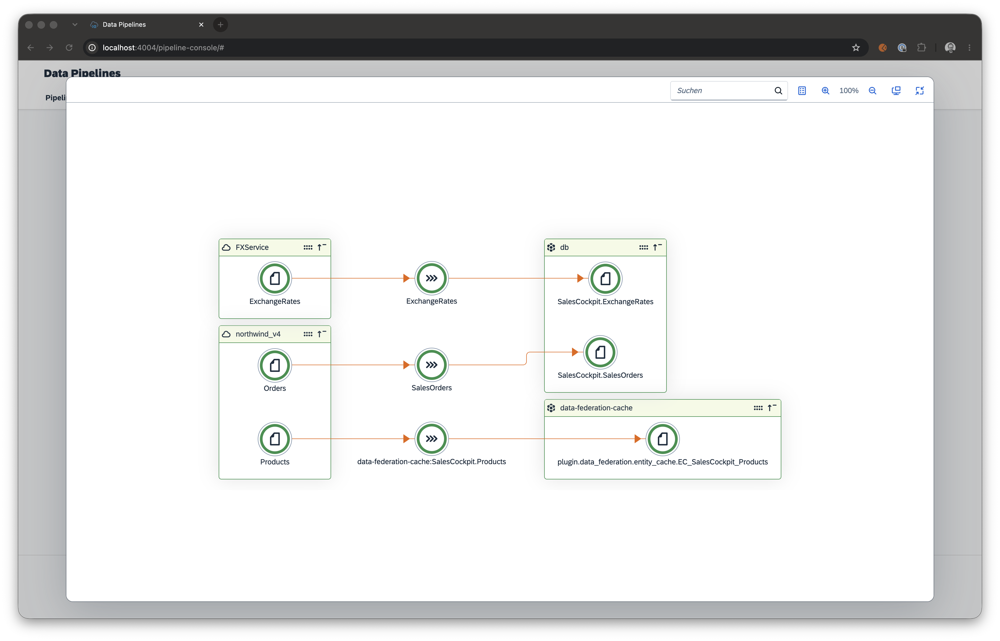
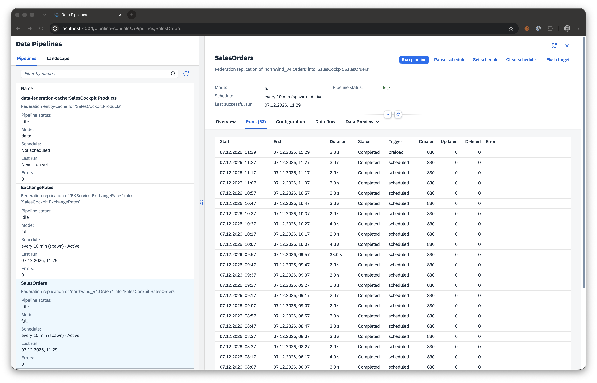

# First Replication

This walkthrough copies remote data into your local database on a schedule. Afterwards, queries run fully locally — joinable, aggregatable, offline-capable.

## When to replicate instead of delegate

| You want | Pick |
|---|---|
| Up-to-the-second data | [Delegate](first-delegation.md) |
| Joins across remote data and local data in SQL | Replicate |
| Aggregations / analytics on remote data | Replicate |
| Resilience against remote outages | Replicate |
| Writes that must land in the system of record | [Delegate](first-delegation.md) (writable) |

## 1. Declare a replicate consumption view

```cds title="srv/external-service.cds"
using { API_BUSINESS_PARTNER as remote } from './external/API_BUSINESS_PARTNER';

service ExternalService {

    @federation.replicate: { schedule: 600000, preload: true, delta: { field: 'LastChangeDateTime' } }
    entity ReplicatedPartners as projection on remote.A_BusinessPartner {
        BusinessPartner         as ID,
        BusinessPartnerFullName as name,
        BusinessPartnerCategory as category,
        LastChangeDateTime
    };

}
```

- `schedule: 600000` — re-sync every 10 minutes via `cds.spawn`. Omit for manual-only mode.
- `preload: true` — run one initial sync at server startup so the local table has data immediately, instead of staying empty until the first `schedule` tick. Use `preload: { wait: true }` to block boot until that first load finishes. See [Initial load on startup](/federation/reference/annotations#initial-load-on-startup).
- `delta: { field: 'LastChangeDateTime' }` — only fetch records modified since the last successful run.
- The plugin turns this projection into a **local table** (`@cds.persistence.skip: false`, `@cds.persistence.table`).

## 2. Activate the tracker tables

`@federation.replicate` is backed by the `cds-data-pipeline` engine, which persists its run state in two tracking tables (`plugin.data_pipeline.Pipelines`, `plugin.data_pipeline.PipelineRuns`). Adding `cds-data-pipeline` to your `dependencies` loads the *engine*, but the tracker **schema** is opt-in. Without it, boot fails on the first pipeline run with:

```
Error: no such table: plugin_data_pipeline_Pipelines
```

Pick one of these to bring the schema into your model:

- **Tracker tables only** — add to any `.cds` file in your model (e.g. `db/schema.cds`):

```cds
using from 'cds-data-pipeline/db';
```

- **Tracker tables + `/pipeline` management API** — set `management.reuse.api` on the engine's `cds.requires` entry:

```json title="package.json"
{
  "cds": {
    "requires": {
      "data-pipeline": {
        "impl": "cds-data-pipeline",
        "management": { "reuse": { "api": true } }
      }
    }
  }
}
```

Then deploy the schema via `cds deploy` (local / SQLite) or your HDI container (HANA). The plugin does no runtime DDL. See [Feature activation](/pipeline/guide/feature-activation) for the full matrix and the "do not combine" rules.

## 3. Boot the app

```bash
cds watch
```

On startup you'll see something like:

```
[cds-data-federation] scheduled replication ReplicatedPartners (every 600000ms)
[cds-data-federation] PIPELINE.READ ReplicatedPartners — initial full sync
[cds-data-federation] PIPELINE.WRITE ReplicatedPartners — 1234 records upserted
```

## 4. Query the local table

After the first sync:

```http
GET /external/ReplicatedPartners?$filter=category eq 'Z001'&$orderby=name
```

This is a plain local SQL query. Join with other local tables, aggregate, filter — everything SQL supports.

## Manual triggers and management

`@federation.replicate` entities are backed by the pipeline engine, which exposes an OData management service at `/pipeline` (enable it with `management.reuse.api`):

```http
POST /pipeline/execute
Content-Type: application/json

{ "name": "ReplicatedPartners", "mode": "full" }
```

See the [cds-data-pipeline Management Service](/pipeline/reference/management-service) for all management endpoints.

### Pipeline Console

For a visual monitor, enable the pre-built UI with `management.reuse.console: true` on the `data-pipeline` requires entry (see [Feature activation](/pipeline/guide/feature-activation)). Replicate entities registered by federation appear automatically in the console.





## What you get for free

- Idempotent `UPSERT` writes — re-runs produce no duplicates.
- Concurrency guard — overlapping runs are detected via an optimistic `UPDATE` on the tracker table and return early.
- Retry with exponential backoff + jitter (skips 4xx by default).
- Async generator streaming — large datasets are never loaded fully into memory.
- Three delta modes (`timestamp`, `key`, `datetime-fields`).
- REST adapter with `offset` / `cursor` / `page` pagination — see the [cds-data-pipeline REST adapter](/pipeline/guide/sources/rest).

## Extending the pipeline

Hook into the `PIPELINE.READ` / `PIPELINE.MAP` / `PIPELINE.WRITE` phases via the standard CAP service API:

```javascript
const federation = await cds.connect.to('data-pipeline');

federation.before('PIPELINE.MAP', 'ReplicatedPartners', async (req) => {
    req.data.sourceRecords = req.data.sourceRecords.filter(r => !r.blocked);
});
```

See the [programmatic API reference](/pipeline/reference/management-service#programmatic-api) for the full hook signature.

## Next steps

- [First Cache](first-cache.md) — add caching on top of delegate or replicate.
- [cds-data-pipeline Management Service](/pipeline/reference/management-service) — Pipelines / PipelineRuns OData endpoints.
- [cds-data-pipeline REST adapter](/pipeline/guide/sources/rest) — replicate from services without a CDS model.
