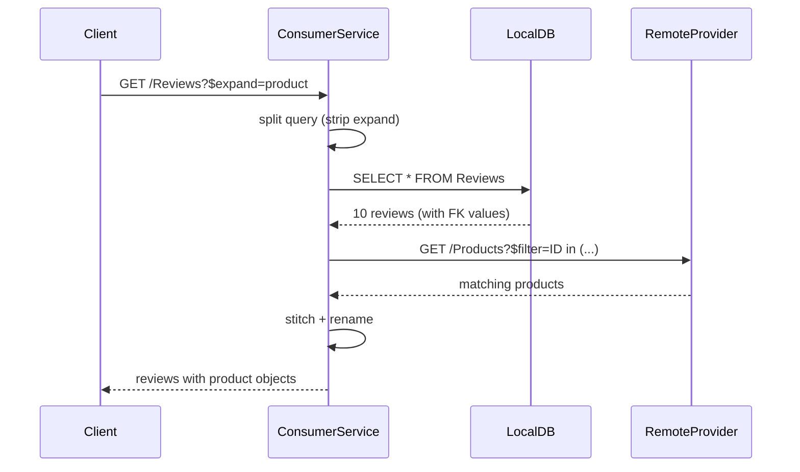

# Joining Local with Remote

Your app owns some data directly — reviews, bookmarks, notes, ratings — and wants to combine it with data that lives in a remote system of record. This page covers the three flows that show up together whenever a **local entity** references a **delegated** one.

## When to use this pattern

- You have a local entity with a foreign key pointing to a remote entity (`product`, `customer`, `supplier`, ...).
- Clients need to see both sides in one response (list reviews with product details, show bookmarks with customer names, filter local reviews by a remote product's name).
- You don't own the remote data and can't store it locally — the system of record stays authoritative.

## The CDS model

A local entity declares a managed association to a federated entity. The plugin handles the rest.

```cds title="db/schema.cds"
using { ProviderService as remote } from '../srv/external/ProviderService';

// Local entity — stored in the app's own DB
entity Reviews {
    key ID        : UUID;
        product   : Association to Products;   // FK to the federated entity below
        rating    : Integer;
        comment   : String(500);
        author    : String(100);
        createdAt : Timestamp;
}

// Federated entity — live proxy to the remote service
@federation.delegate
entity Products as projection on remote.Products {
    ID    as productId,
    name  as productName,
    category,
    price as unitPrice,
    currency
};
```

`Reviews.product` is a plain CAP managed association. CAP materializes a `product_productId` foreign key column on `Reviews` at deploy time. The target — `Products` — is federated and has no local table: reads go to the remote service.

## Flow 1: `$expand` from local to remote

=== "HTTP"

    ```http
    GET /consumer/Reviews?$expand=product&$top=10
    ```

=== "CQL"

    ```javascript
    SELECT.from(Reviews).columns('*', p => p.product('*')).limit(10);
    ```

The plugin:

1. Inspects `req.query.SELECT.columns` for expand items whose target is federated.
2. Strips the federated expand items, executes the local SQL for `Reviews` (without the broken cross-service expand).
3. Collects the distinct `product_productId` values from the result set.
4. Issues **one** remote call: `GET /remote/Products?$filter=ID in ('P001','P002',...)`, with CAP applying the `productId → ID` rename automatically.
5. Builds a lookup map and stitches the remote record into each review's `product` slot, applying `remoteToLocal` renames as the response is mapped back.



One batched remote call, regardless of how many rows the local query returned. The association uses the local field names (`productId`, `productName`, `unitPrice`) — CAP's projection chain handles the two-way translation.

## Flow 2: Cross-service navigation: local → remote

See the canonical definition in [Cross-Service Scenarios](../concepts/cross-service-scenarios.md#cross-service-navigation-local-remote) (integration test `N1`).

Navigation URLs work too — reading the FK from the local row and delegating:

=== "HTTP"

    ```http
    GET /consumer/Reviews(12345678-1234-1234-1234-123456789012)/product
    GET /consumer/Reviews(...)/product?$select=productName,category
    ```

=== "CQL"

    ```javascript
    SELECT.one.from(Reviews, reviewId).columns(r => r.product('*'));
    ```

The plugin resolves the navigation by reading the local row's FK, then issuing a single keyed GET against the remote with rename mapping applied to `$select` as well.

## Flow 3: Cross-service `$filter`

Filtering a local entity by a field on a federated association — e.g., "all reviews whose product is named 'Widget'":

```http
GET /consumer/Reviews?$filter=product/productName eq 'Widget'
```

The filter path crosses a service boundary: `productName` only exists on the remote. The plugin:

1. Recognises `product/productName` as a cross-service navigation filter.
2. Queries the remote: `GET /remote/Products?$filter=name eq 'Widget'&$select=ID`.
3. Rewrites the local query to `SELECT * FROM Reviews WHERE product_productId IN ('P001','P002')`.
4. Returns the matching rows — all from local SQL.

Works combined with local filters and `$expand`:

```http
GET /consumer/Reviews?$filter=rating ge 4 and product/category eq 'Electronics'&$expand=product
```

## Under the hood

This is the **cross-service expand: local → remote** flow described in detail at [Cross-Service Scenarios](../concepts/cross-service-scenarios.md#cross-service-expand-local-remote) (integration tests `B1..B3`). The plugin's [`registerLocalExpandResolvers()`](https://github.com/mikezaschka/cds-data-monorepo/blob/main/packages/cds-data-federation/srv/delegation/expand-local-to-remote.js) installs an `on('READ')` handler for every local entity that has at least one association to a federated entity, plus [`resolveRemoteNavigationFilters()`](https://github.com/mikezaschka/cds-data-monorepo/blob/main/packages/cds-data-federation/srv/delegation/remote-navigation-filters.js) for the `$filter` case.

## Gotchas

- **Composite-key associations** work — the plugin builds OR chains of AND conditions for the remote query (OData has no tuple IN). Example: [`AddressNotes → CustomerAddresses`](https://github.com/mikezaschka/cds-data-monorepo/blob/main/packages/cds-data-federation/test/fixtures/consumer/db/schema.cds) with `custId + addressType`.
- **Excluding columns** are honoured in the batch-fetch — if the federated target uses `excluding { email }`, the plugin omits `email` from `$select` in the remote call.
- **Nested `$expand`** inside a federated expand works (`$expand=product($expand=category)`) — remote expand options are forwarded with names translated recursively.
- **Lambda operators in `$filter` over a federated to-many** (`$filter=reviews/any(r:r.rating eq 5)`) — supported via [`resolveRemoteLambdaFilters()`](https://github.com/mikezaschka/cds-data-monorepo/blob/main/packages/cds-data-federation/srv/delegation/expand-local-to-remote.js), rewrites to an IN filter.
- **Writing through the association** (creating a Review with `product_productId: 'P001'`) writes only the FK to the local DB. It does **not** create a remote product. Use the federated entity's own CUD endpoints for that.

## See also

- [Extending Remote with Local](extending-remote-with-local.md) — the opposite direction (federated entity with a local backlink).
- [Cross-Provider Mashup](cross-provider-mashup.md) — local entity joining two different remote services.
- [Cross-Service Scenarios](../concepts/cross-service-scenarios.md) — the canonical concept page with all four expand topologies, both navigation flows, and design rationale.
- [Consumption Views](../concepts/consumption-views.md) — how renames in the projection become the bidirectional translation used by the stitching step.
