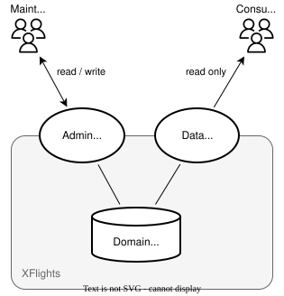
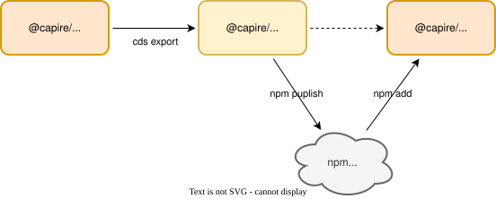
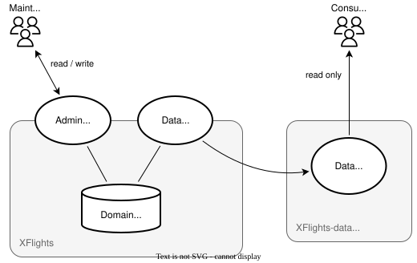

# @capire/xflights

This is a reuse package to manage and serve master data like _Airlines_, _Airports_, and _Flights_.
It publishes a [pre-built client package](#publishing-apis), that is used in the [xtravels](https://github.com/capire/xtravels) application.

##### Table of Contents

- [Domain Model](#domain-model)
- [Service Interfaces](#service-interfaces)
- [Exporting APIs](#exporting-apis)
- [Publishing APIs](#publishing-apis)
- [Consuming APIs](#consuming-apis)
- [Using Workspaces](#using-workspaces)


## Domain Model

The domain model is defined in [_db/schema.cds_](./db/schema.cds). It centers around normalized `FlightConnections`, which connect two `Airports` operated by an `Airline`, while entity `Flights` represents scheduled flights on specific dates with a specific aircraft and price.


## Service Interfaces

Two service interfaces are defined in [_srv/admin-service.cds_](./srv/admin-service.cds), and [_srv/data-service.cds_](./srv/data-service.cds), to serve different use cases as shown below:

- an admin service to _maintain_ the master data from UIs or remote systems
- a data service to _consume_ it from remote applications




> [!tip]
>
> <details> <summary> Serving denormalized views </summary>
> The data service exposes a denormalized view of `Flights` and associated `FlightConnections` data, essentially declared like that:
>
> ```cds
> entity Flights as projection on my.Flights {
>   *,          // all elements from Flights
>   flight.*,   // all elements from FlightConnections
> }
> ```
>
> With that consumers aren't bothered with normalized data but can just consume flat data, looking like that:
>
> 
>
> </details>


## Exporting APIs

Given the respective service definition, we create a pre-built client package for the data API, which can be used from consuming apps in a plug-and-play fashion.



We use `cds export` to create the API package, based on the Data Service definition:

```sh
cds export srv/data-service.cds
```

This generates a separate CAP reuse package within subfolder [_apis/data-service_](./apis/data-service/) that contains only the effective service API definitions, accompanied by automatically derived test data and i18n bundles.



Initially, `cds export` also adds a `package.json`, which we can modify as appropriate, and did so by changing the package name to `@capire/xflights-data`:

```diff
{
- "name": "@capire/xflights-data-service",
+ "name": "@capire/xflights-data",
  ...
}
```


## Publishing APIs

We can finally share this package with consuming applications using standard ways, like `npm publish`:

```sh
cd apis/data-service
npm publish
```


> [!tip]
>
> <details> <summary>Using GitHub Packages</summary>
>
> Within the [_capire_](https://github.com/capire) org, we're publishing to [GitHub Packages](https://docs.github.com/packages), which requires you to npm login once like that:
>
> ```sh
> npm login --scope=@capire --registry=https://npm.pkg.github.com
> ```
>
> As password you're using a Personal Access Token (classic) with `read:packages` scope (for retrieving and installing a package). Read more about that in [Authenticating to GitHub Packages](https://docs.github.com/en/packages/working-with-a-github-packages-registry/working-with-the-npm-registry#authenticating-to-github-packages).
> </details>


## Consuming APIs

Use the published client package in your consuming application by installing it via `npm`:

```sh
npm add @capire/xflights-data
```

With that, we can use the imported models as usual, and as if they were local in mashups with our own entities like so:

```cds
using { sap.capire.flights.FlightsService as imported } from '@capire/xflights-data';
entity TravelBookings { //...
  flight : Association to imported.Flights;
}
```

▷ Learn more about consuming APIs and CAP-level data integration in the [_xtravels_ application](https://github.com/capire/xtravels/blob/main/db/xflights.cds).


## Using Workspaces

Instead of exercising a workflow like that again and again:

- ( *develop* → *export* → *publish* ) → *npmjs.com* → ( *update* → *consume* )

... we can use *npm workspaces* technique to work locally and speed up things as follows:

```shell
mkdir -p cap/works; cd cap/works
git clone https://github.com/capire/xflights
git clone https://github.com/capire/xtravels
echo '{"workspaces":["xflights","xtravels"]}' > package.json
```

Add a link to the local `@capire/xflights-data` API package, enclosed with the cloned xflights sources:

```shell
npm add ./xflights/apis/data-service
```

Check the installation using `npm ls`, which would yield output as below, showing that `@capire/xtravel`'s dependency to `@capire/xflights-data` is nicely fulfilled by a local link to `./xflights/apis/data-service`:

```shell
npm ls @capire/xflights-data
```

```zsh
works@ ~/cap/works
├── @capire/xflights-data@0.1.11 -> ./xflights/apis/data-service
└─┬ @capire/xtravels@1.0.0 -> ./xtravels
  └── @capire/xflights-data@0.1.11 deduped -> ./xflights/apis/data-service
```

Start the xtravels application → and note the sources loaded from *./xflights/apis/data-service*, and the information further below about the `FlightsService` service mocked automatically:

```shell
cds watch xtravels
```

```zsh
[cds] - loaded model from 20 file(s):

  xtravels/srv/travel-service.cds
  xtravels/db/schema.cds
  xtravels/db/xflights.cds
  xflights/apis/data-service/index.cds
  xflights/apis/data-service/services.csn
  ...
```

```zsh
[cds] - mocking sap.capire.flights.FlightsService {
  at: [ '/odata/v4/data', '/rest/data', '/hcql/data' ],
  decl: 'xflights/apis/data-service/services.csn:3',
}
```


## Using Proxy Packages

The usage of *npm workspaces* technique as described above streamlined our workflows as follows:

- Before: ( *develop* → *export* → *publish* ) → *npmjs.com* → ( *update* → *consume* )
- After: ( *develop* → *export* ) → ( *consume* )

We can even more streamline that by eliminating the export step as follows...

Create a new subfolder `xflights-api-shortcut`  in which we add two files as follows:

```shell
mkdir xflights-api-shortcut
```

Add a `package.json` file in there with that content:

```json
{
  "name": "@capire/xflights-data",
  "dependencies": {
    "@capire/xflights": "*"
  }
}
```

And an `index.cds` file with that content:

```cds
using from '@capire/xflights/srv/data-service';
```

<details> <summary> Using the shell's "here document" technique </summary>

  You can also create those two files from the command line as follows:
  ```shell
  cat > xflights-api-shortcut/package.json << EOF
  {
    "name": "@capire/xflights-data",
    "dependencies": {
      "@capire/xflights": "*"
    }
  }
  EOF
  ```

  Take the same approach for the `index.cds` file:
  ```shell
  cat > xflights-api-shortcut/index.cds << EOF
  using from '@capire/xflights/srv/data-service';
  EOF
  ```

</details>
With that in place, change our API package dependency in the workspace root as follows:

```shell
npm add ./xflights-api-shortcut
```

Check the effect of that → note how `@capire/xflights-data` dependencies now link to `./xflights-api-shortcut`:

```shell
npm ls @capire/xflights-data
```

```zsh
works@ ~/cap/works
├── @capire/xflights-data@ -> ./xflights-api-shortcut
└─┬ @capire/xtravels@1.0.0 -> ./xtravels
  └── @capire/xflights-data@ deduped -> ./xflights-api-shortcut≤
```

Start the *xtravels* application → and note the sources loaded from *./xflights-api-shortcut*, and the information further below about the `FlightsService` service now being _served_, not _mocked_ anymore:

```shell
cds watch xtravels
```

```zsh
[cds] - loaded model from 20 file(s):

  xtravels/srv/travel-service.cds
  xtravels/db/schema.cds
  xtravels/db/xflights.cds
  xflights-api-shortcut/index.cds
  xflights/srv/data-service.cds
  xflights/db/schema.cds
  ...
```

```zsh
[cds] - serving sap.capire.flights.FlightsService {
  at: [ '/odata/v4/data', '/rest/data', '/hcql/data' ],
  decl: 'xflights/apis/data-service/services.csn:3',
}
```

Which means we've streamlined our workflows as follows:

- Before: ( *change* → *export* → *publish* ) → *npmjs.com* → ( *update* → *consume* )
- Step 1: ( *change* → *export* ) → ( *consume* )
- Step 2: ( *change* ) → ( *consume* )


## License

Copyright (c) 2026 SAP SE or an SAP affiliate company. All rights reserved. This file is licensed under the Apache Software License, version 2.0 except as noted otherwise in the [LICENSE](LICENSE) file.
